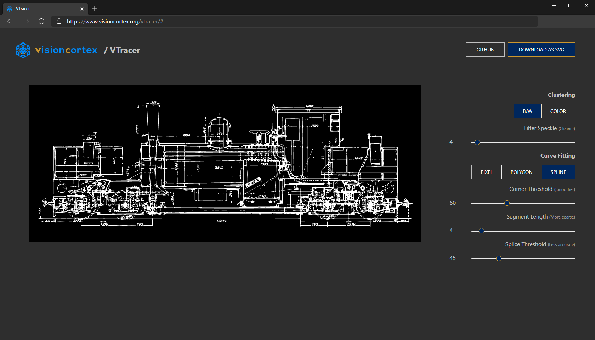

<div align="center">

  
  <h1>visioncortex VTracer</h1>

  <p>
    <strong>Raster to Vector Graphics Converter built on top of visioncortex</strong>
  </p>

  <h3>
    <a href="//www.visioncortex.org/vtracer-docs">Document</a>
    <span> | </span>
    <a href="//www.visioncortex.org/vtracer/">Demo</a>
    <span> | </span>
    <a href="//github.com/visioncortex/vtracer/releases/latest">Download</a>
  </h3>

  <sub>Built with 🦀 by <a href="//www.visioncortex.org/">The Vision Cortex Research Group</a></sub>
</div>

## Introduction

visioncortex VTracer is an open source software to convert raster images (like jpg & png) into vector graphics (svg). It can vectorize graphics and photographs and trace the curves to output compact vector files.

Comparing to [Potrace]() which only accept binarized inputs (Black & White pixmap), VTracer has an image processing pipeline which can handle colored high resolution scans.

Comparing to Adobe Illustrator's Live Trace, VTracer's output is much more compact (less shapes) as we adopt a stacking strategy and avoid producing shapes with holes.

VTracer is originally designed for processing high resolution scans of historic blueprints up to gigapixels. By setting both `filter_speckle` and `layer_difference` to `0`, VTracer can also handle low resolution pixel art, effectively achieving `image-rendering: pixelated` for retro game artworks.

A technical description of the algorithm is on [visioncortex.org/vtracer-docs](//www.visioncortex.org/vtracer-docs).

## Web App

VTracer and its [core library](//github.com/visioncortex/visioncortex) is implemented in [Rust](//www.rust-lang.org/). It provides us a solid foundation to develop robust and efficient algorithms and easily bring it to interactive applications. The webapp is a perfect showcase of the capability of the Rust + HTML5 platform.




## Command Line
```
visioncortex VTracer                                                                                                      
A cmd app to convert images into vector graphics.                                                                         
                                                                                                                          
USAGE:                                                                                                                    
    vtracer [OPTIONS] --input <input> --output <output>                                                                   
                                                                                                                          
FLAGS:                                                                                                                    
    -h, --help       Prints help information                                                                              
    -V, --version    Prints version information                                                                           
                                                                                                                          
OPTIONS:                                                                                                                  
        --colormode <color_mode>                 True color image `color` (default) or Binary image `bw`                  
    -p, --color_precision <color_precision>      Number of significant bits to use in an RGB channel                      
    -c, --corner_threshold <corner_threshold>    Minimum momentary angle (degree) to be considered a corner               
    -f, --filter_speckle <filter_speckle>        Discard patches smaller than X px in size                                
    -g, --gradient_step <gradient_step>          Color difference between gradient layers                                 
    -i, --input <input>                          Path to input raster image                                               
    -m, --mode <mode>                            Curver fitting mode `pixel`, `polygon`, `spline`                         
    -o, --output <output>                        Path to output vector graphics                                           
        --preset <preset>                        Use one of the preset configs `bw`, `poster`, `photo`                    
    -l, --segment_length <segment_length>                                                                                 
            Perform iterative subdivide smooth until all segments are shorter than this length                            
                                                                                                                          
    -s, --splice_threshold <splice_threshold>    Minimum angle displacement (degree) to splice a spline                   
```

### Usage
```
./vtracer --input input.jpg --output output.svg
```

## Library

The library can be found on [crates.io/vtracer](//crates.io/crates/vtracer).

### Install
```
vtracer = "*"
```
